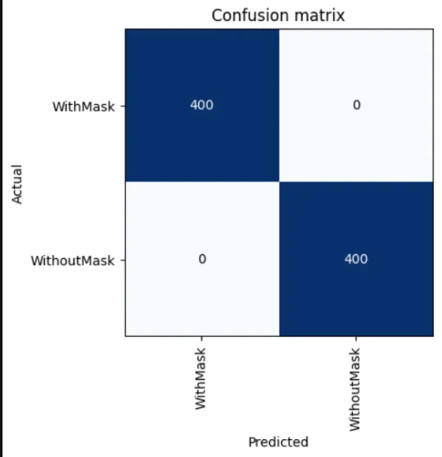
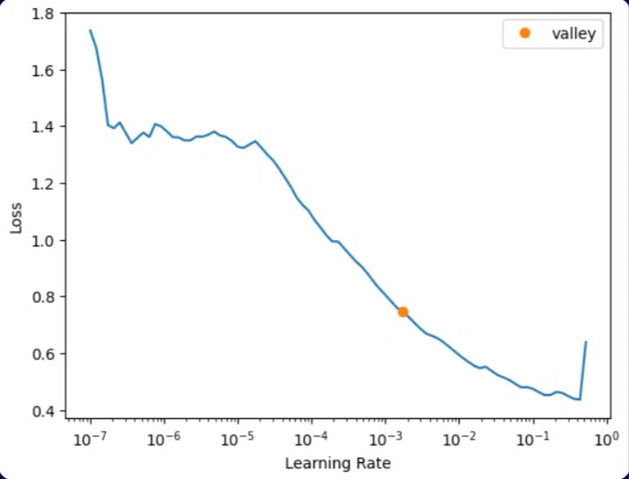
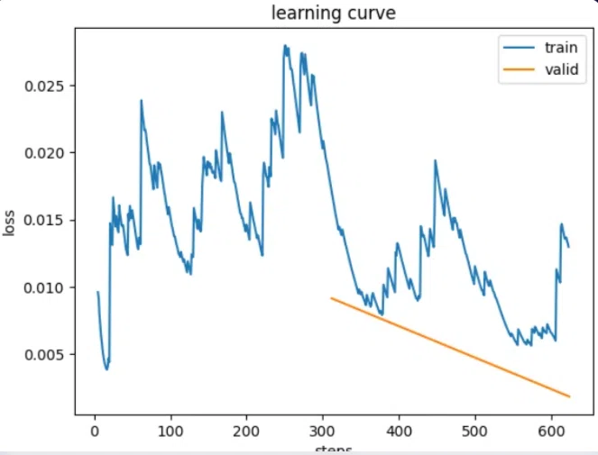
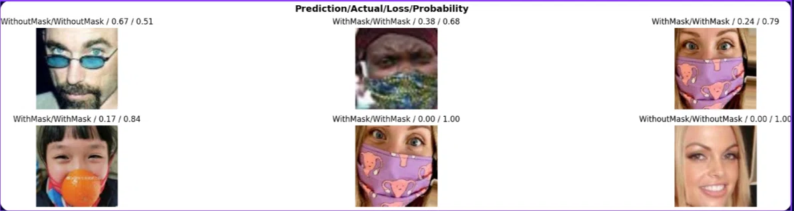

# Face Mask Detection using CNN (Transfer Learning)

A Deep Learning project that automatically detects whether a person is wearing a face mask or not from a facial image, using a pre-trained **ResNet50** model with **FastAI**.

---

## Problem

During the COVID-19 pandemic, wearing face masks became an essential safety measure to reduce the spread of infectious diseases. However, monitoring mask compliance manually in crowded places is difficult and time-consuming.

**The problem addressed in this project:**
> Can Artificial Intelligence automatically detect whether a person is wearing a face mask correctly or not?

---

## Solution

A CNN-based binary image classifier built with **FastAI** and **ResNet50** via **Transfer Learning**. The model classifies facial images into two categories:

- ✅ **With Mask**
- ❌ **Without Mask**

This system can be integrated into smart surveillance cameras and real-time monitoring systems.

---

## Dataset

- **Source:** Kaggle Face Mask Dataset
- **Size:** 7,500+ facial images
  - ~3,700 labeled **With Mask**
  - ~3,800 labeled **Without Mask**
- **Type:** RGB images (JPG / PNG)
- **Split:** Train / Validation / Test
- **Variations:** different face angles, lighting conditions, mask styles, and backgrounds

---

## Approach

1. **Data Loading** — `ImageDataLoaders.from_folder()` with images resized to 224×224, batch size 32.
2. **Transfer Learning** — Pre-trained **ResNet50** (trained on ImageNet) with frozen layers.
3. **Learning Rate Search** — `lr_find()` to find the optimal LR (valley ≈ `1.7e-3`).
4. **Training** — `fit_one_cycle(4, slice(1e-3))` using Adam optimizer and Binary Crossentropy loss.
5. **Hyperparameter Tuning** — `unfreeze()` + `fit_one_cycle(2, slice(1e-5, 1e-3))` to fine-tune deeper layers.

---

## Results

| Metric | Value |
|---|---|
| **Validation Accuracy** | **97.62%** |
| **Test Accuracy** | **96.57%** |
| Validation Loss | 0.1035 |
| Test Loss | 0.0926 |

### Confusion Matrix

### Learning Rate Finder

### Learning Curve

### Top Losses (Hardest 6 Images)

> The model's hardest cases were images with sunglasses, colored masks, or unusual angles — all correctly classified but with lower confidence.

---

## Files

| File | Description |
|---|---|
| `Face_Mask_Detection.ipynb` | Full notebook (data loading, training, evaluation) |
| `Face_Mask_Detection.pdf` | Project presentation |
| `Confusion_Matrix.jpg` | Confusion matrix visualization |
| `Learning_Rate_Finder.jpg` | LR finder plot |
| `Learning_Curve.jpg` | Training vs validation loss curve |
| `plot_top_losses.jpg` | Top 6 highest-loss images |

---

## Team

- Haneen Adel Abdelrahman Attia
- Nourhan Mahmoud El Sherbiny
- Menna Tarek Abdelrahman Elfar
- Shahd Mohamed Ismail Hatab
- Nada Yousry Ibrahim Elalfy
- Hager Mohamed Elsayed Elazzazy

**Supervisor:** Prof. Dr. Gamal Behery

---

## My Contribution

Contributed as part of a 6-member team in the Deep Learning project, including:
- Assisting in preparing and exploring the dataset
- Supporting the training and evaluation process
- Participating in interpreting the model results (confusion matrix, top losses)

---

## Tech Stack

- **Language:** Python 3.13
- **Deep Learning:** FastAI + PyTorch
- **Model:** ResNet50 (pre-trained on ImageNet)
- **Libraries:** NumPy, Pandas, Matplotlib
- **Environment:** Jupyter Notebook

---

## Future Work

- 🎥 Deploy as a real-time surveillance system (webcam / video stream)
- 📱 Mobile app integration
- 🧠 Extend to 3 classes: With Mask / Without Mask / Incorrectly Worn
- 📊 Improve accuracy on hard cases (sunglasses, colored masks, unusual angles)

---

## Acknowledgements

We thank **Prof. Dr. Gamal Behery** for his supervision and continuous support throughout this project.
